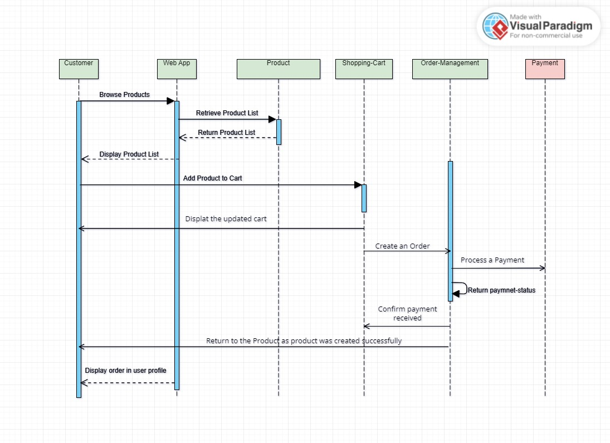
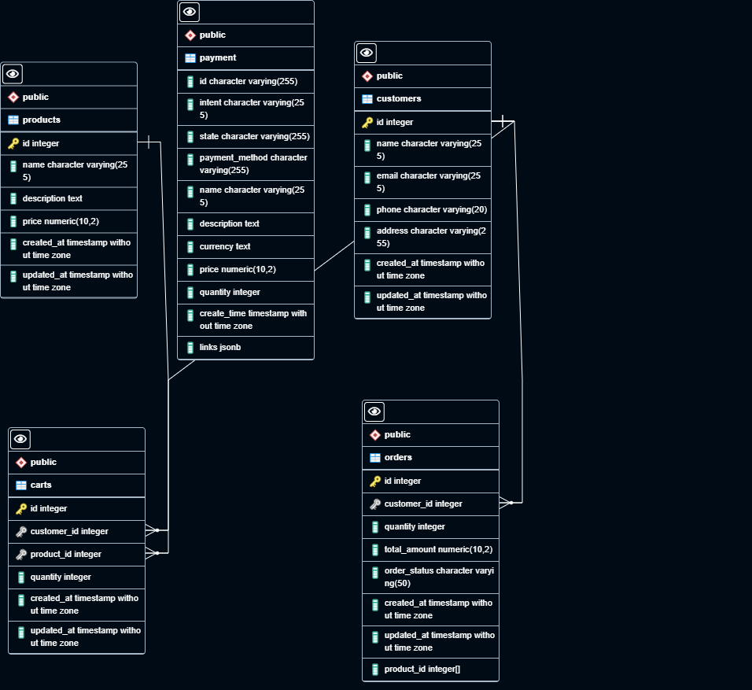

# Modular E-commerce Purchase Express App

This Express app is designed to handle various e-commerce purchase components in a modular fashion. The app includes modules for managing users, orders, shopping cart, products, and payments.

## Table of Contents

- [Modules](#modules)
- [Sequence Diagram](#Sequence-diagram)
- [DB Diagram](#db-diagram)
- [Installation](#installation)
- [Usage](#usage)
- [API Endpoints](#api-endpoints)
- [Testing](#testing)
- [Project Structure](#Project-Structure)
- [How To Run](#How-to-Run)
- [Contributing](#contributing)
- [Author](#Author)

## Modules

1. **Users Module:** Manages user-related operations such as creating, updating, and retrieving user information.

2. **Products Module:** Handles product-related operations, such as listing available products.

3. **Shopping Cart Module:** Manages shopping cart functionalities, including adding and removing items.

4. **Orders Module:** Handles order creation, tracking, and management.

5. **Payment Module:** Manages payment processing for completed orders.


## Sequence Diagram



## DB Diagram



## Installation

1. Clone the repository:

    ```bash
    git clone https://github.com/ahmedmeddhatt/Modular-eccomerce-purchase.git
    ```

2. Install dependencies:

    ```bash
    npm install
    ```

## Usage

Start the app:

```bash
npm run start
```

Visit [http://localhost:3000](http://localhost:3000) to interact with the app.

Certainly! Below are the API endpoints formatted for your specified structure:

## API Endpoints

### Users Module

1. **GET /api/users**
   - Retrieve all users.

2. **GET /api/users/:id**
   - Retrieve a specific user.

3. **POST /api/users**
   - Create a new user.
   ```json
   {
       "name": "ahmed",
       "email": "ahmed@user.com",
       "phone": "01111138720",
       "address": "Madenty"
   }
   ```

4. **PUT /api/users/:id**
   - Update user information.
   ```json
   {
       "name": "Mohamed",
       "email": "Mohamed@user.com",
       "phone": "01111138720",
       "address": "6 october"
   }
   ```

5. **DELETE /api/users/:id**
   - Delete a user.

### Products Module

6. **GET /api/products**
   - Retrieve all products.

7. **GET /api/products/:id**
   - Retrieve a specific product.

8. **POST /api/products**
   - Create a new product.
   ```json
   {
       "name": "tv smart 30",
       "description": "new tv smart 30",
       "price": 60
   }
   ```

9. **PUT /api/products/:id**
   - Update product information.
   ```json
   {
       "name": "tv smart 20",
       "description": "new tv smart 20",
       "price": 40
   }
   ```

10. **DELETE /api/products/:id**
    - Delete a product.

### Shopping Cart Module

11. **GET /api/cart**
    - Retrieve all the cart.

12. **GET /api/cart/:orderId**
    - Retrieve the shopping cart for a specific order.

13. **POST /api/cart/**
    - Add a product to the shopping cart by adding the userId & orderId.
    ```json
    {
        "userId": 297,
        "productId": 28,
        "quantity": 10
    }
    ```

14. **PUT /api/cart/:id**
    - Update cart information.
    ```json
    {
        "userId": 2,
        "productId": 3,
        "quantity": 10000
    }
    ```

15. **DELETE /api/cart/:id**
    - Delete the cart.

16. **POST /api/cart/:orderId/remove/:productId**
    - Remove a product from the shopping cart.

### Orders Module

17. **GET /api/orders**
    - Retrieve all orders.

18. **GET /api/orders/:id**
    - Retrieve a specific order.

19. **POST /api/orders**
    - Create a new order.
    ```json
    {
        "userId": 301,
        "productId": [40, 29, 42],
        "quantity": 17,
        "orderStatus": "created"
    }
    ```

20. **PUT /api/orders/:id**
    - Update order information.
    ```json
    {
        "userId": 301,
        "productId": [28, 41, 42],
        "quantity": 20,
        "orderStatus": "created"
    }
    ```

21. **DELETE /api/orders/:id**
    - Delete an order.

### Payment Module

22. **GET /api/payment/payment-details**
    - Retrieve all the payments.

23. **GET /api/payment/payment-details/:paymentId**
    - Retrieve the payment, order, user details for a specific transaction.

24. **POST /api/payment/buy**
    - Process payment for a specific order.
    ```json
    {
        "payment_method": "Master-Card",
        "name": "Onion",
        "description": "Vegetables",
        "currency": "EUR",
        "price": "3.99",
        "quantity": 12
    }
    ```

Feel free to adjust any details or add more information based on your specific application needs.

## Testing

[Cypress](https://www.cypress.io/) tests are included for each API endpoint. To run the tests:

```bash
npx cypress open
```

- Choose E2E test & Run all the tests.


## Project Structure

```
Modular E-commerce Purchase/
|-- user/
|   |-- controllers
|       |-- userController.js
|   |-- db-script
|       |-- user.sql
|   |-- models
|       |-- userModel.js
|   |-- routes
|       |-- userRoutes.js
|-- orders/
|   |-- controllers
|       |-- orderController.js
|   |-- db-script
|       |-- order.sql
|   |-- models
|       |-- orderModel.js
|   |-- routes
|       |-- orderRoutes.js
|-- product/
|   |-- controllers
|       |-- productController.js
|   |-- db-script
|       |-- product.sql
|   |-- models
|       |-- productModel.js
|   |-- routes
|       |-- productRoutes.js
|-- shopping-cart/
|   |-- controllers
|       |-- cartController.js
|   |-- db-script
|       |-- cart.sql
|   |-- models
|       |-- cartModel.js
|   |-- routes
|       |-- cartRoutes.js
|-- payment/
|   |-- controllers
|       |-- paymentController.js
|   |-- db-script
|       |-- payment.sql
|   |-- services
|       |-- paymentService.js
|   |-- routes
|       |-- paymentRoutes.js
|-- cypress/
|   |-- downloads
|       |-- downloads.htm.crdownload
|   |-- e2e
|       |-- 01-userTest.cy.js
|       |-- 02-productTest.cy.js
|       |-- 03-orderTest.cy.js
|       |-- 04-cartTest.cy.js
|       |-- 05-paymentTest.cy.js
|   |-- fixtures
|       |-- example.json
|   |-- support
|       |-- commands.js
|       |-- e2e.js
|-- .gitignore
|-- app.js
|-- db.js
|-- cypress.config.js
|-- package.json
|-- README.md
```

## How to Run


1. Install dependencies:

    ```bash
    npm i
    ```

2. Run the application:

    ```bash
    npm run start
    ```


## Contributing
Anyone can clone the repo, run it on the localhost & try the project features.

## Author

Ahmed Medhat